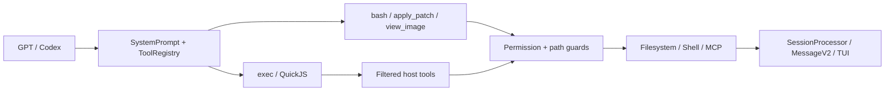

# MiMoCode's Codex Microkernel Runtime for GPT Models

> “Codex microkernel runtime” is this document's summary of the current architecture. It is not an official module name in the source code, nor does it refer to an operating-system-level microkernel.

## Abstract

MiMoCode runs GPT/Codex models on a shared Session engine while exposing a smaller, Codex-style tool ABI to them: `bash`, `apply_patch`, `view_image`, and `exec`. `exec` composes authorized host tools inside QuickJS; permissions, paths, subprocesses, cancellation, persistence, and UI always remain under host control.

## Core Design

MiMoCode does not create a separate Agent engine for GPT. Instead, it does three things on top of the unified Session runtime:

1. Uses a GPT/Codex-specific system prompt that defines tool selection and orchestration conventions;
2. Uses `ToolRegistry` to assemble a smaller, model-specific tool ABI;
3. Provides QuickJS-based `exec` to compose host tools without expanding permissions.

The core principle is:

> The model decides what to do, `exec` determines how to compose the operations, and the host decides whether they are allowed and how their side effects are produced.

## GPT Tool ABI

[`ToolRegistry.available()`](../../packages/opencode/src/tool/registry.ts#L363) currently determines whether to enable the GPT profile from the model ID: the ID must contain `gpt-`, while `oss` and `gpt-4` are excluded.

| Tool visible to GPT | Purpose |
| --- | --- |
| `bash` | Inspect and search files with `rg`, `sed`, and similar tools, and execute commands |
| `apply_patch` | Modify text files with structured patches |
| `view_image` | Convert local JPEG, PNG, GIF, and WebP files into model attachments |
| `exec` | Batch-call and aggregate host tools inside QuickJS |

The GPT profile hides the overlapping `read`, `write`, `edit`, `multiedit`, `grep`, `glob`, and `notebook_edit` capabilities. Other tools remain governed by the provider, agent allowlist, and runtime permissions.

[`SystemPrompt.provider()`](../../packages/opencode/src/session/system.ts#L24) independently selects `gpt.txt`, `codex.txt`, or `beast.txt`. Prompt routing and tool profiles currently use two separate sets of string rules; they have not yet been unified into a model-capability negotiation layer.

## The `exec` Microkernel

[`ToolScriptTool`](../../packages/opencode/src/tool/tool-script.ts#L303) is exposed to the model as `exec`. The model submits a TypeScript/JavaScript async function body and calls host tools through `tools.<name>()`.

### Why It Cannot Bypass Permissions

[`tool-script-ref.ts`](../../packages/opencode/src/tool/tool-script-ref.ts#L1) uses a late-bound registry so that `exec` receives the same `Tool.Def` instances as the outer layer, after model/agent filtering:

- `read`, `write`, and `edit` tools invisible to the outer layer do not reappear inside `exec`;
- Built-in subcalls execute the original `Tool.Def.execute()` and `Tool.Context`;
- MCP subcalls still execute `ctx.ask()` individually;
- `exec_command` is only an alias for `bash`, with the same permissions and execution path.

Control-flow tools such as `task`, `actor`, `question`, `skill`, `workflow`, `cron`, and `session` are excluded because they change conversation or scheduling state and should not be hidden inside a single script call.

### Two Security Boundaries

1. [`evalScript()`](../../packages/opencode/src/workflow/sandbox.ts#L106) isolates guest code with QuickJS and provides no Node, `process`, `fetch`, timers, or module loading;
2. Actual side effects are still performed by host tools and pass through permissions, external-directory checks, memory guards, and each tool's own validation.

QuickJS isolates only the `exec` code. `bash` remains a real shell, not a container sandbox.

### Resource Limits

| Resource | Default / Limit |
| --- | --- |
| Nested tool calls | 50 by default, 500 maximum |
| Concurrent calls | 8 |
| Active computation | 60 seconds by default, 600 seconds maximum |
| Wall clock | 30 minutes |
| Guest memory | 64 MiB by default |
| Code / return value / logs | 128 KiB / 256 KiB / 64 KiB |
| Single `files.*` file | 10 MiB |

`files.readText` can read only UTF-8 text within the worktree or OS temporary directory; `files.writeText` can write only to the OS temporary directory. Project changes must use permission-controlled host tools.

## Other Key Primitives

### `apply_patch`

Before writing, [`ApplyPatchTool`](../../packages/opencode/src/tool/apply_patch.ts#L24) parses all hunks, checks paths, computes the diff, and requests `edit` permission. After writing, it publishes file events, runs formatting, and refreshes the LSP.

It prevalidates the entire patch, but multi-file writes are not transactional. A failure partway through does not automatically roll back files already written.

### `view_image`

[`ViewImageTool`](../../packages/opencode/src/tool/view-image.ts#L23) checks the model's image capability, external-directory access, and `read` permission, then validates the image format and returns a data URL attachment.

Current limitations:

- `detail` is recorded only in metadata and does not change image processing;
- There is no separate image size limit;
- `exec` passes only text, metadata, and JSON values. It cannot forward image attachments, so images should be handled by calling `view_image` directly.

## OpenAI Responses

The OpenAI provider sends requests through [`sdk.responses(modelID)`](../../packages/opencode/src/provider/provider.ts#L203). [`ProviderTransform.options()`](../../packages/opencode/src/provider/transform.ts#L1275) sets `store: false` by default and requests `reasoning.encrypted_content` for GPT-5 reasoning models.

MiMoCode writes provider metadata into messages and replays it in the next turn, allowing stateless Responses tool loops to continue reasoning. Before sending, it also removes `itemId` values that cannot be safely reused, preventing the server or proxy from failing to parse stale `rs_...` references.

[`CodexAuthPlugin`](../../packages/opencode/src/plugin/codex.ts#L364) separately handles ChatGPT Plus/Pro OAuth, token refresh, account headers, and Codex endpoint rewriting. It belongs to the authentication and transport layer and does not alter tool permissions.

## PR Evolution

[PR #1865](https://github.com/XiaomiMiMo/MiMo-Code/pull/1865) is a stacked PR whose base points to #1864's `feat/view-image-tool` branch. It first introduced:

- GPT-specific Bash guidance;
- masking of overlapping file tools;
- aligned skill-search prompts and reminders for GPT and Claude.

[PR #1864](https://github.com/XiaomiMiMo/MiMo-Code/pull/1864) then added `view_image`, broader tool masking, the `tool_script → exec` transition, the GPT prompt, TUI integration, and checkpoint support before the complete stack was merged into `main`.

Today, `skill_search` remains visible to GPT and Claude, but the system prompt and reminder do not proactively ask those models to search. This is a later refinement of #1865's original tool-masking policy.

## Current Gaps

- Model classification relies on string heuristics, so prompt and tool-profile rules can drift;
- `codex.txt` still mentions Read/Edit/Write/Glob/Grep tools hidden by the GPT profile;
- `view_image` exposure and its runtime image-capability check are not fully aligned;
- `files.readText` relies on a path jail and does not perform the normal `read` permission ask;
- QuickJS does not provide OS-level isolation for Bash;
- GPT profile cases for `exec`, the Bash description, `skill_search`, and `multiedit` are currently skipped in [`registry-invocation-style.test.ts`](../../packages/opencode/test/tool/registry-invocation-style.test.ts#L17).

## Key Source Files

- [`session/system.ts`](../../packages/opencode/src/session/system.ts): model prompt routing;
- [`tool/registry.ts`](../../packages/opencode/src/tool/registry.ts): GPT tool ABI;
- [`tool/tool-script.ts`](../../packages/opencode/src/tool/tool-script.ts): `exec` declaration, dispatch, budgets, and results;
- [`tool/tool-script-ref.ts`](../../packages/opencode/src/tool/tool-script-ref.ts): shared tool filtering and control-flow exclusions;
- [`workflow/sandbox.ts`](../../packages/opencode/src/workflow/sandbox.ts): QuickJS sandbox;
- [`session/prompt.ts`](../../packages/opencode/src/session/prompt.ts): tool execution context and permission routing;
- [`provider/transform.ts`](../../packages/opencode/src/provider/transform.ts): Responses reasoning round-trip.
