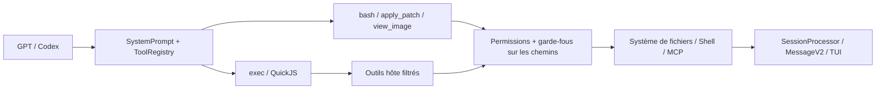

# Environnement d’exécution à micronoyau Codex de MiMoCode pour les modèles GPT

> « Environnement d’exécution à micronoyau Codex » est la formulation employée dans ce document pour résumer l’architecture actuelle. Il ne s’agit ni du nom officiel d’un module dans le code source, ni d’une référence à un micronoyau de système d’exploitation.

## Résumé

MiMoCode exécute les modèles GPT/Codex sur un moteur de Session partagé, tout en leur exposant une ABI d’outils plus restreinte, dans le style de Codex : `bash`, `apply_patch`, `view_image` et `exec`. `exec` compose dans QuickJS des outils hôte préalablement autorisés ; les permissions, les chemins, les sous-processus, l’annulation, la persistance et l’interface utilisateur restent toujours sous le contrôle de l’hôte.

## Conception fondamentale

MiMoCode n’a pas créé un moteur d’Agent distinct pour GPT. Il effectue plutôt trois opérations sur l’environnement d’exécution unifié de Session :

1. utiliser un system prompt propre à GPT/Codex, qui définit la sélection et l’orchestration des outils ;
2. assembler, au moyen de `ToolRegistry`, une ABI d’outils plus restreinte et propre au modèle ;
3. fournir `exec` fondé sur QuickJS afin de composer les outils hôte sans étendre les permissions.

Le principe fondamental est le suivant :

> Le modèle décide quoi faire, `exec` détermine comment composer les opérations, et l’hôte décide si elles sont autorisées et comment produire leurs effets de bord.

## ABI des outils GPT

À l’heure actuelle, [`ToolRegistry.available()`](../../packages/opencode/src/tool/registry.ts#L363) détermine à partir de l’ID du modèle si le profil GPT doit être activé : l’ID doit contenir `gpt-`, à l’exclusion de `oss` et de `gpt-4`.

| Outil visible par GPT | Rôle |
| --- | --- |
| `bash` | Inspecter et rechercher des fichiers avec `rg`, `sed`, etc., ainsi qu’exécuter des commandes |
| `apply_patch` | Modifier des fichiers texte au moyen d’un patch structuré |
| `view_image` | Convertir des fichiers locaux JPEG, PNG, GIF ou WebP en pièces jointes pour le modèle |
| `exec` | Appeler par lots et agréger des outils hôte dans QuickJS |

Le profil GPT masque les outils aux fonctions redondantes : `read`, `write`, `edit`, `multiedit`, `grep`, `glob` et `notebook_edit`. Les autres outils restent régis par le provider, l’allowlist de l’agent et les permissions de l’environnement d’exécution.

[`SystemPrompt.provider()`](../../packages/opencode/src/session/system.ts#L24) sélectionne indépendamment `gpt.txt`, `codex.txt` ou `beast.txt`. Le routage du prompt et le profil des outils reposent actuellement sur deux ensembles distincts de règles fondées sur des chaînes de caractères ; ils n’ont pas encore été unifiés dans une couche de négociation des capacités du modèle.

## Micronoyau `exec`

[`ToolScriptTool`](../../packages/opencode/src/tool/tool-script.ts#L303) est exposé au modèle sous le nom `exec`. Le modèle soumet le corps d’une fonction async TypeScript/JavaScript et appelle les outils hôte via `tools.<name>()`.

### Pourquoi les permissions ne peuvent pas être contournées

[`tool-script-ref.ts`](../../packages/opencode/src/tool/tool-script-ref.ts#L1) utilise un registre à liaison tardive, de sorte que `exec` obtient les mêmes `Tool.Def` que la couche externe, déjà filtrées selon le modèle et l’agent :

- les outils `read`, `write` et `edit`, invisibles dans la couche externe, ne réapparaissent pas dans `exec` ;
- les sous-appels builtin exécutent les méthodes `Tool.Def.execute()` et les `Tool.Context` d’origine ;
- les sous-appels MCP exécutent toujours `ctx.ask()` à chaque appel ;
- `exec_command` n’est qu’un alias de `bash` et partage les mêmes permissions et le même chemin d’exécution.

Les outils de contrôle de flux tels que `task`, `actor`, `question`, `skill`, `workflow`, `cron` et `session` sont exclus, car ils modifient l’état de la conversation ou de l’orchestration et ne doivent pas être dissimulés dans un appel de script unique.

### Deux niveaux de sécurité

1. [`evalScript()`](../../packages/opencode/src/workflow/sandbox.ts#L106) isole le guest code au moyen de QuickJS, sans exposer Node, `process`, `fetch`, les timers ni le chargement de modules ;
2. les véritables effets de bord sont toujours exécutés par les outils hôte et soumis aux permissions, au contrôle `external-directory`, au memory guard ainsi qu’aux validations propres à chaque outil.

QuickJS isole uniquement le code de `exec`. `bash` reste un véritable Shell et ne s’exécute pas dans un container sandbox.

### Limites de ressources

| Ressource | Valeur par défaut / limite |
| --- | --- |
| Appels d’outils imbriqués | 50 par défaut, 500 au maximum |
| Appels concurrents | 8 |
| Calcul actif | 60 secondes par défaut, 600 secondes au maximum |
| Wall clock | 30 minutes |
| Mémoire du guest | 64 MiB par défaut |
| Code / valeur de retour / journaux | 128 KiB / 256 KiB / 64 KiB |
| Fichier individuel via `files.*` | 10 MiB |

`files.readText` ne peut lire que du texte UTF-8 situé dans le worktree ou le répertoire temporaire du système d’exploitation ; `files.writeText` ne peut écrire que dans ce dernier. Les modifications apportées au projet doivent passer par des outils hôte soumis au contrôle des permissions.

## Autres primitives essentielles

### `apply_patch`

Avant toute écriture, [`ApplyPatchTool`](../../packages/opencode/src/tool/apply_patch.ts#L24) analyse tous les hunks, vérifie les chemins, calcule le diff et demande la permission `edit` ; après l’écriture, il publie les événements relatifs aux fichiers, exécute le formatage et actualise le LSP.

Il prévalide l’intégralité du patch, mais les écritures portant sur plusieurs fichiers ne sont pas transactionnelles : en cas d’échec en cours d’opération, les fichiers déjà écrits ne sont pas automatiquement restaurés.

### `view_image`

[`ViewImageTool`](../../packages/opencode/src/tool/view-image.ts#L23) vérifie la capacité image du modèle, `external-directory` et la permission `read`, puis valide le format de l’image et renvoie une pièce jointe sous forme de data URL.

Limites actuelles :

- `detail` est uniquement inscrit dans les metadata et ne modifie pas le traitement de l’image ;
- aucune limite distincte ne s’applique à la taille des images ;
- `exec` ne transmet que du texte, des metadata et des valeurs JSON ; il ne peut pas relayer les pièces jointes de type image. Il convient donc d’appeler directement `view_image` pour les images.

## OpenAI Responses

Le provider OpenAI envoie les requêtes via [`sdk.responses(modelID)`](../../packages/opencode/src/provider/provider.ts#L203). [`ProviderTransform.options()`](../../packages/opencode/src/provider/transform.ts#L1275) définit `store: false` par défaut et demande `reasoning.encrypted_content` pour les modèles de reasoning GPT-5.

MiMoCode enregistre les metadata du provider dans le message et les rejoue au tour suivant, afin que la boucle d’outils Responses sans état puisse poursuivre le raisonnement. Avant l’envoi, il supprime également les `itemId` qui ne peuvent pas être réutilisés de manière sûre, afin d’éviter que le serveur ou le proxy échoue à analyser des références `rs_...` invalides.

[`CodexAuthPlugin`](../../packages/opencode/src/plugin/codex.ts#L364) gère séparément l’OAuth ChatGPT Plus/Pro, le token refresh, les headers de compte et l’endpoint rewrite de Codex. Il appartient à la couche d’authentification et de transport et ne modifie pas les permissions des outils.

## Évolution des PR

La [PR #1865](https://github.com/XiaomiMiMo/MiMo-Code/pull/1865) est une PR empilée dont la base pointe vers la branche `feat/view-image-tool` de la #1864. Elle a d’abord introduit :

- des instructions Bash propres à GPT ;
- le masquage des outils de fichiers aux capacités redondantes ;
- l’alignement des prompts et rappels de recherche de skills pour GPT et Claude.

La [PR #1864](https://github.com/XiaomiMiMo/MiMo-Code/pull/1864) a ensuite ajouté `view_image`, un masquage plus complet des outils, la transition `tool_script → exec`, le prompt GPT, l’intégration TUI et la prise en charge des checkpoints, avant que l’ensemble ne soit fusionné dans `main`.

Aujourd’hui, `skill_search` reste visible pour GPT et Claude, mais le prompt système et le rappel ne leur demandent pas proactivement d’effectuer une recherche. Il s’agit d’un ajustement ultérieur de la politique initiale de masquage de la #1865.

## Lacunes actuelles

- La classification des modèles repose sur des heuristiques de chaînes, de sorte que les règles de prompt et de profil d’outils peuvent diverger ;
- `codex.txt` mentionne encore les outils Read/Edit/Write/Glob/Grep masqués par le profil GPT ;
- l’exposition de `view_image` et sa vérification à l’exécution de la capacité image ne sont pas totalement alignées ;
- `files.readText` repose sur un confinement de chemins et n’effectue pas la demande de permission `read` habituelle ;
- QuickJS ne fournit pas d’isolation Bash au niveau du système d’exploitation ;
- les cas du profil GPT concernant `exec`, la description Bash, `skill_search` et `multiedit` sont actuellement ignorés dans [`registry-invocation-style.test.ts`](../../packages/opencode/test/tool/registry-invocation-style.test.ts#L17).

## Fichiers source clés

- [`session/system.ts`](../../packages/opencode/src/session/system.ts) : routage des prompts de modèle ;
- [`tool/registry.ts`](../../packages/opencode/src/tool/registry.ts) : ABI des outils GPT ;
- [`tool/tool-script.ts`](../../packages/opencode/src/tool/tool-script.ts) : déclaration, dispatch, budgets et résultats de `exec` ;
- [`tool/tool-script-ref.ts`](../../packages/opencode/src/tool/tool-script-ref.ts) : filtrage partagé des outils et exclusion du contrôle de flux ;
- [`workflow/sandbox.ts`](../../packages/opencode/src/workflow/sandbox.ts) : sandbox QuickJS ;
- [`session/prompt.ts`](../../packages/opencode/src/session/prompt.ts) : contexte d’exécution des outils et routage des permissions ;
- [`provider/transform.ts`](../../packages/opencode/src/provider/transform.ts) : round-trip du raisonnement Responses.
