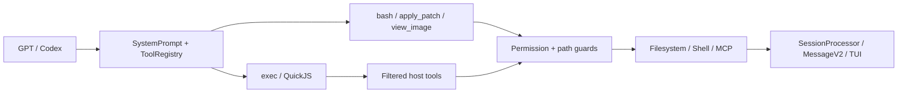

# GPT モデル向け MiMoCode Codex マイクロカーネルランタイム

> 「Codex マイクロカーネルランタイム」は、本稿における現行アーキテクチャの総称であり、ソースコード上の正式なモジュール名ではなく、OS レベルのマイクロカーネルを意味するものでもありません。

## 概要

MiMoCode は、共有 Session エンジン上で GPT/Codex モデルを実行すると同時に、より小規模な Codex スタイルのツール ABI、すなわち `bash`、`apply_patch`、`view_image`、`exec` をモデルに公開します。`exec` は QuickJS 内で、許可されたホストツールを組み合わせます。権限、パス、サブプロセス、キャンセル、永続化、UI は常にホストによって制御されます。

## コア設計

MiMoCode は GPT 専用の Agent エンジンを新設するのではなく、統一された Session runtime 上で次の三つを行います。

1. GPT/Codex 専用の system prompt を使用し、ツールの選択方法とスケジューリング方法を規定する。
2. `ToolRegistry` を介して、より小規模なモデル専用ツール ABI を構成する。
3. 権限を拡大することなくホストツールを組み合わせる QuickJS `exec` を提供する。

コア原則は次のとおりです。

> モデルが何を行うかを決定し、`exec` がその組み合わせ方を担い、ホストが許可の可否と副作用の発生方法を決定します。

## GPT ツール ABI

現在、[`ToolRegistry.available()`](../../packages/opencode/src/tool/registry.ts#L363) はモデル ID に基づいて GPT profile を有効にするかどうかを判定します。ID に `gpt-` が含まれ、かつ `oss` と `gpt-4` が除外されている場合に有効になります。

| GPT から見えるツール | 用途 |
| --- | --- |
| `bash` | `rg`、`sed` などを使用してファイルを調査・検索し、コマンドを実行する |
| `apply_patch` | 構造化された patch でテキストファイルを変更する |
| `view_image` | ローカルの JPEG、PNG、GIF、WebP をモデル用 attachment に変換する |
| `exec` | QuickJS 内でホストツールを一括呼び出しし、結果を集約する |

GPT profile では、機能が重複する `read`、`write`、`edit`、`multiedit`、`grep`、`glob`、`notebook_edit` が非表示になります。その他のツールは引き続き、provider、agent allowlist、runtime permission によって管理されます。

[`SystemPrompt.provider()`](../../packages/opencode/src/session/system.ts#L24) は、`gpt.txt`、`codex.txt`、`beast.txt` のいずれかを独立して選択します。Prompt のルーティングとツール profile は現在、二つの異なる文字列ルールに基づいており、モデル能力のネゴシエーションレイヤーとしてはまだ統合されていません。

## `exec` マイクロカーネル

[`ToolScriptTool`](../../packages/opencode/src/tool/tool-script.ts#L303) は `exec` としてモデルに公開されます。モデルは TypeScript/JavaScript の async function body を送信し、`tools.<name>()` を介してホストツールを呼び出します。

### 権限を迂回できない理由

[`tool-script-ref.ts`](../../packages/opencode/src/tool/tool-script-ref.ts#L1) は late-bound registry を使用するため、`exec` が取得するのは外側と同じ、model/agent によるフィルタリング済みの `Tool.Def` です。

- 外側から見えない `read`、`write`、`edit` が `exec` 内で再び現れることはありません。
- builtin のサブ呼び出しは、元の `Tool.Def.execute()` と `Tool.Context` を実行します。
- MCP のサブ呼び出しでも、毎回 `ctx.ask()` が実行されます。
- `exec_command` は単なる `bash` のエイリアスであり、権限と実行経路は同一です。

`task`、`actor`、`question`、`skill`、`workflow`、`cron`、`session` などの制御フローツールは除外されています。これらは対話やスケジューリングの状態を変更するため、一度のスクリプト呼び出しの中に隠すのには適していません。

### 二層のセキュリティ境界

1. [`evalScript()`](../../packages/opencode/src/workflow/sandbox.ts#L106) は QuickJS で guest code を隔離し、Node、`process`、`fetch`、timer、モジュール読み込みを提供しません。
2. 実際の副作用は引き続きホストツールによって実行され、permission、external-directory、memory guard、各ツール固有の検証を経ます。

QuickJS が隔離するのは `exec` のコードのみです。`bash` は引き続き実際の Shell であり、コンテナ sandbox ではありません。

### リソース制限

| リソース | デフォルト値 / 上限 |
| --- | --- |
| ネストされたツール呼び出し | デフォルト 50、最大 500 |
| 並行呼び出し | 8 |
| アクティブ計算時間 | デフォルト 60 秒、最大 600 秒 |
| Wall clock | 30 分 |
| Guest メモリ | デフォルト 64 MiB |
| コード / 戻り値 / ログ | 128 KiB / 256 KiB / 64 KiB |
| `files.*` の単一ファイル | 10 MiB |

`files.readText` が読み取れるのは、worktree または OS tmp 内にある UTF-8 テキストのみです。`files.writeText` が書き込めるのは OS tmp のみです。プロジェクトの変更には、権限制御されたホストツールを呼び出す必要があります。

## その他の主要プリミティブ

### `apply_patch`

[`ApplyPatchTool`](../../packages/opencode/src/tool/apply_patch.ts#L24) は、書き込み前にすべての hunks を解析し、パスを検査して diff を計算したうえで `edit` permission を要求します。書き込み後はファイルイベントを発行し、フォーマットを実行して LSP を更新します。

すべての patch を事前検証しますが、複数ファイルへの書き込みはトランザクションではなく、途中で失敗しても書き込み済みのファイルは自動的にロールバックされません。

### `view_image`

[`ViewImageTool`](../../packages/opencode/src/tool/view-image.ts#L23) は、モデルの image capability、external-directory、`read` permission を確認した後、画像形式を検証し、data URL attachment を返します。

現在の制限事項は次のとおりです。

- `detail` は metadata に書き込まれるだけで、画像処理には影響しません。
- 画像サイズには個別の制限がありません。
- `exec` が受け渡せるのはテキスト、metadata、JSON 値のみで、画像 attachment は透過的に受け渡せません。そのため、画像には `view_image` を直接呼び出す必要があります。

## OpenAI Responses

OpenAI provider は、[`sdk.responses(modelID)`](../../packages/opencode/src/provider/provider.ts#L203) を介してリクエストを送信します。[`ProviderTransform.options()`](../../packages/opencode/src/provider/transform.ts#L1275) はデフォルトで `store: false` を設定し、GPT-5 reasoning モデルには `reasoning.encrypted_content` を要求します。

MiMoCode は provider metadata をメッセージに書き込み、次のターンで再生することで、ステートレスな Responses ツールループが推論を継続できるようにします。同時に、送信前に安全に再利用できない `itemId` を取り除き、サーバーまたはプロキシによる無効な `rs_...` 参照の解析エラーを回避します。

[`CodexAuthPlugin`](../../packages/opencode/src/plugin/codex.ts#L364) は別途、ChatGPT Plus/Pro OAuth、token refresh、アカウント header、Codex endpoint rewrite を担います。これは認証・トランスポート層に属し、ツールの権限を変更するものではありません。

## PR の変遷

[PR #1865](https://github.com/XiaomiMiMo/MiMo-Code/pull/1865) は stacked PR で、base は #1864 の `feat/view-image-tool` ブランチです。まず次の変更を導入しました。

- GPT 専用の Bash ガイダンス
- 機能が重複するファイルツールの非表示化
- GPT/Claude 向け skill-search prompt と reminder の整合

その後、[PR #1864](https://github.com/XiaomiMiMo/MiMo-Code/pull/1864) で `view_image`、より包括的なツールの非表示化、`tool_script → exec` への移行、GPT prompt、TUI、checkpoint 対応が追加され、最終的に一式が `main` にマージされました。

現在も `skill_search` は GPT/Claude に公開されていますが、system prompt と reminder は能動的な検索を要求しません。これは #1865 の当初のツール非表示化方針を後から調整したものです。

## 現在の課題

- モデル分類が文字列ヒューリスティックに依存しており、Prompt とツール profile のルールが乖離する可能性がある
- `codex.txt` には、GPT profile で非表示になった Read/Edit/Write/Glob/Grep ツールが今も記載されている
- `view_image` の公開条件と実行時の image capability check が完全には一致していない
- `files.readText` は path jail に依存し、通常の `read` permission ask を実行しない
- QuickJS は Bash に OS レベルの分離を提供しない
- [`registry-invocation-style.test.ts`](../../packages/opencode/test/tool/registry-invocation-style.test.ts#L17) では、GPT の `exec`、Bash description、`skill_search`、`multiedit` の profile テストが現在スキップされている

## 主要ソースコード

- [`session/system.ts`](../../packages/opencode/src/session/system.ts)：モデル prompt のルーティング
- [`tool/registry.ts`](../../packages/opencode/src/tool/registry.ts)：GPT ツール ABI
- [`tool/tool-script.ts`](../../packages/opencode/src/tool/tool-script.ts)：`exec` の宣言、dispatch、budget、結果
- [`tool/tool-script-ref.ts`](../../packages/opencode/src/tool/tool-script-ref.ts)：同一ソースによるツール filtering と制御フローの除外
- [`workflow/sandbox.ts`](../../packages/opencode/src/workflow/sandbox.ts)：QuickJS sandbox
- [`session/prompt.ts`](../../packages/opencode/src/session/prompt.ts)：ツール実行 context と permission routing
- [`provider/transform.ts`](../../packages/opencode/src/provider/transform.ts)：Responses reasoning の round-trip
