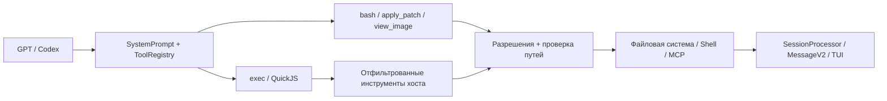

# Микроядерная среда выполнения Codex в MiMoCode для моделей GPT

> «Микроядерная среда выполнения Codex» — это используемое в данной статье обобщённое название текущей архитектуры, а не официальное имя модуля в исходном коде; оно также не означает микроядро уровня операционной системы.

## Краткое описание

MiMoCode запускает модели GPT/Codex на общем движке сеансов и предоставляет им сокращённый ABI инструментов в стиле Codex: `bash`, `apply_patch`, `view_image` и `exec`. `exec` компонует авторизованные инструменты хоста внутри QuickJS, при этом разрешения, пути, дочерние процессы, отмена, сохранение состояния и пользовательский интерфейс всегда остаются под контролем хоста.

## Основная архитектура

MiMoCode не создаёт для GPT отдельный агентный движок, а выполняет три задачи поверх единой среды выполнения сеансов:

1. Использует специальный системный промпт для GPT/Codex, определяющий порядок выбора и оркестрации инструментов;
2. Формирует с помощью `ToolRegistry` сокращённый ABI инструментов, предназначенный для конкретной модели;
3. Предоставляет `exec` на базе QuickJS для композиции инструментов хоста без расширения разрешений.

Основной принцип:

> Модель решает, что делать, `exec` определяет, как это скомпоновать, а хост решает, разрешено ли действие и каким образом оно создаёт побочные эффекты.

## ABI инструментов GPT

[`ToolRegistry.available()`](../../packages/opencode/src/tool/registry.ts#L363) в настоящее время определяет необходимость включения профиля GPT по идентификатору модели: идентификатор должен содержать `gpt-`, но не должен содержать `oss` или `gpt-4`.

| Инструмент, доступный GPT | Назначение |
| --- | --- |
| `bash` | Просмотр и поиск файлов с помощью `rg`, `sed` и других средств, а также выполнение команд |
| `apply_patch` | Изменение текстовых файлов с помощью структурированного патча |
| `view_image` | Преобразование локальных файлов JPEG, PNG, GIF и WebP во вложения для модели |
| `exec` | Пакетный вызов и агрегация инструментов хоста внутри QuickJS |

Профиль GPT скрывает инструменты с пересекающимися возможностями: `read`, `write`, `edit`, `multiedit`, `grep`, `glob` и `notebook_edit`. Остальные инструменты по-прежнему управляются настройками провайдера, списком разрешённых инструментов агента и разрешениями среды выполнения.

[`SystemPrompt.provider()`](../../packages/opencode/src/session/system.ts#L24) независимо выбирает `gpt.txt`, `codex.txt` или `beast.txt`. В настоящее время маршрутизация промптов и выбор профиля инструментов основаны на двух разных наборах строковых правил и ещё не объединены в единый слой согласования возможностей модели.

## Микроядро `exec`

[`ToolScriptTool`](../../packages/opencode/src/tool/tool-script.ts#L303) предоставляется модели под именем `exec`. Модель передаёт тело асинхронной функции TypeScript/JavaScript и вызывает инструменты хоста через `tools.<name>()`.

### Почему разрешения нельзя обойти

В [`tool-script-ref.ts`](../../packages/opencode/src/tool/tool-script-ref.ts#L1) используется реестр с поздним связыванием, благодаря которому `exec` получает те же `Tool.Def`, уже отфильтрованные по модели и агенту, что и внешний уровень:

- Недоступные на внешнем уровне `read`, `write` и `edit` не появляются повторно внутри `exec`;
- Вложенные вызовы встроенных инструментов используют исходные `Tool.Def.execute()` и `Tool.Context`;
- Вложенные вызовы MCP по-прежнему каждый раз выполняют `ctx.ask()`;
- `exec_command` — лишь псевдоним `bash` с теми же разрешениями и путём выполнения.

Инструменты управления потоком `task`, `actor`, `question`, `skill`, `workflow`, `cron`, `session` и другие исключены, поскольку они изменяют состояние диалога или оркестрации и не должны быть скрыты внутри одного вызова скрипта.

### Два уровня защиты

1. [`evalScript()`](../../packages/opencode/src/workflow/sandbox.ts#L106) изолирует гостевой код с помощью QuickJS и не предоставляет Node, `process`, `fetch`, таймеры или загрузку модулей;
2. Реальные побочные эффекты по-прежнему выполняются инструментами хоста и проходят проверки разрешений (permission), внешних каталогов (external-directory), защиты памяти (memory guard), а также проверки самих инструментов.

QuickJS изолирует только код `exec`. `bash` по-прежнему является реальной командной оболочкой, а не контейнерной песочницей.

### Ограничения ресурсов

| Ресурс | Значение по умолчанию / предел |
| --- | --- |
| Вложенные вызовы инструментов | По умолчанию 50, максимум 500 |
| Параллельные вызовы | 8 |
| Активные вычисления | По умолчанию 60 секунд, максимум 600 секунд |
| Общее время выполнения | 30 минут |
| Память гостевой среды | По умолчанию 64 MiB |
| Код / возвращаемое значение / журнал | 128 KiB / 256 KiB / 64 KiB |
| Один файл `files.*` | 10 MiB |

`files.readText` может читать только текст UTF-8 из worktree или OS tmp; `files.writeText` может записывать только в OS tmp. Для изменений в проекте необходимо вызывать инструменты хоста, контролируемые системой разрешений.

## Другие ключевые примитивы

### `apply_patch`

Перед записью [`ApplyPatchTool`](../../packages/opencode/src/tool/apply_patch.ts#L24) разбирает все фрагменты патча, проверяет пути, вычисляет различия и запрашивает разрешение `edit`; после записи он публикует события файлов, запускает форматирование и обновляет LSP.

Все части патча проходят предварительную проверку, однако запись нескольких файлов не является транзакционной: ошибка в процессе не приводит к автоматическому откату уже записанных файлов.

### `view_image`

[`ViewImageTool`](../../packages/opencode/src/tool/view-image.ts#L23) проверяет поддержку изображений моделью (image capability), доступ к внешним каталогам (external-directory) и разрешение `read`, затем проверяет формат изображения и возвращает вложение в виде data URL.

Текущие ограничения:

- `detail` записывается только в метаданные и не влияет на обработку изображения;
- Отдельное ограничение размера изображения отсутствует;
- `exec` передаёт только текст, метаданные и значения JSON, но не может передавать вложения с изображениями, поэтому для изображений следует напрямую вызывать `view_image`.

## OpenAI Responses

Провайдер OpenAI отправляет запросы через [`sdk.responses(modelID)`](../../packages/opencode/src/provider/provider.ts#L203). [`ProviderTransform.options()`](../../packages/opencode/src/provider/transform.ts#L1275) по умолчанию устанавливает `store: false` и запрашивает `reasoning.encrypted_content` для моделей GPT-5 с поддержкой рассуждений.

MiMoCode записывает метаданные провайдера в сообщение и воспроизводит их в следующем цикле, позволяя не сохраняющему состояние инструментальному циклу Responses продолжать рассуждение; одновременно перед отправкой удаляются `itemId`, которые нельзя безопасно использовать повторно, чтобы сервер или прокси не пытался разобрать недействительные ссылки `rs_...`.

[`CodexAuthPlugin`](../../packages/opencode/src/plugin/codex.ts#L364) отдельно отвечает за OAuth ChatGPT Plus/Pro, обновление токена, заголовок учётной записи и перезапись конечной точки Codex. Он относится к уровню аутентификации и транспорта и не изменяет разрешения инструментов.

## Эволюция PR

[PR #1865](https://github.com/XiaomiMiMo/MiMo-Code/pull/1865) — это stacked PR, базой которого служит ветка `feat/view-image-tool` из #1864. Сначала он добавил:

- специальные инструкции Bash для GPT;
- скрытие файловых инструментов с пересекающимися возможностями;
- согласование prompt и reminder для поиска skills у GPT и Claude.

Затем [PR #1864](https://github.com/XiaomiMiMo/MiMo-Code/pull/1864) добавил `view_image`, более полное скрытие инструментов, переход `tool_script → exec`, prompt GPT, интеграцию с TUI и поддержку checkpoint, после чего весь набор изменений был объединён с `main`.

Сейчас `skill_search` по-прежнему доступен GPT и Claude, однако system prompt и reminder не предлагают этим моделям выполнять поиск автоматически. Это более позднее уточнение первоначальной политики скрытия инструментов из #1865.

## Текущие пробелы

- Классификация моделей основана на строковых эвристиках, поэтому правила Prompt и профиля инструментов могут расходиться;
- `codex.txt` всё ещё упоминает инструменты Read/Edit/Write/Glob/Grep, скрытые профилем GPT;
- условия показа `view_image` и проверка поддержки изображений во время выполнения согласованы не полностью;
- `files.readText` полагается на ограничение путей и не выполняет обычный запрос разрешения `read`;
- QuickJS не обеспечивает для Bash изоляцию на уровне операционной системы;
- тесты профиля GPT для `exec`, описания Bash, `skill_search` и `multiedit` в [`registry-invocation-style.test.ts`](../../packages/opencode/test/tool/registry-invocation-style.test.ts#L17) сейчас пропущены.

## Ключевые исходные файлы

- [`session/system.ts`](../../packages/opencode/src/session/system.ts): маршрутизация prompt моделей;
- [`tool/registry.ts`](../../packages/opencode/src/tool/registry.ts): ABI инструментов GPT;
- [`tool/tool-script.ts`](../../packages/opencode/src/tool/tool-script.ts): объявление `exec`, dispatch, бюджеты и результаты;
- [`tool/tool-script-ref.ts`](../../packages/opencode/src/tool/tool-script-ref.ts): единая фильтрация инструментов и исключение управления потоком;
- [`workflow/sandbox.ts`](../../packages/opencode/src/workflow/sandbox.ts): sandbox QuickJS;
- [`session/prompt.ts`](../../packages/opencode/src/session/prompt.ts): контекст выполнения инструментов и маршрутизация разрешений;
- [`provider/transform.ts`](../../packages/opencode/src/provider/transform.ts): round-trip рассуждений Responses.
